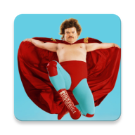
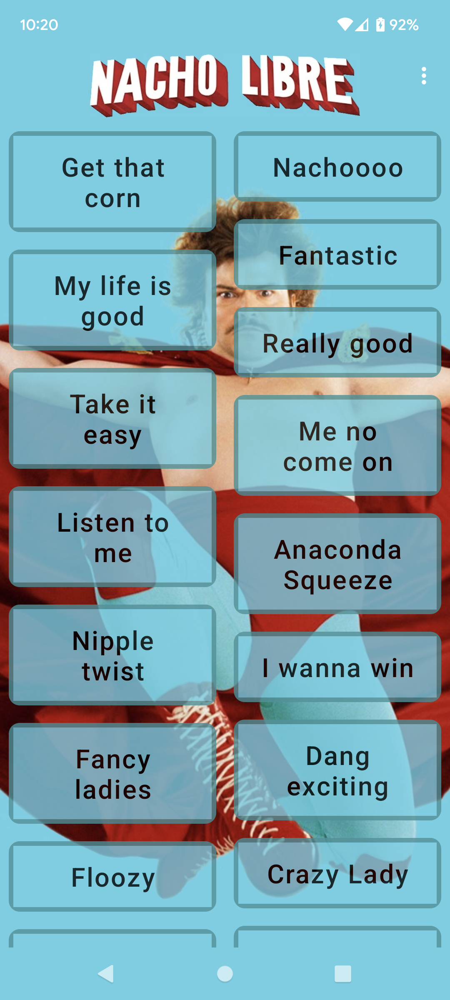
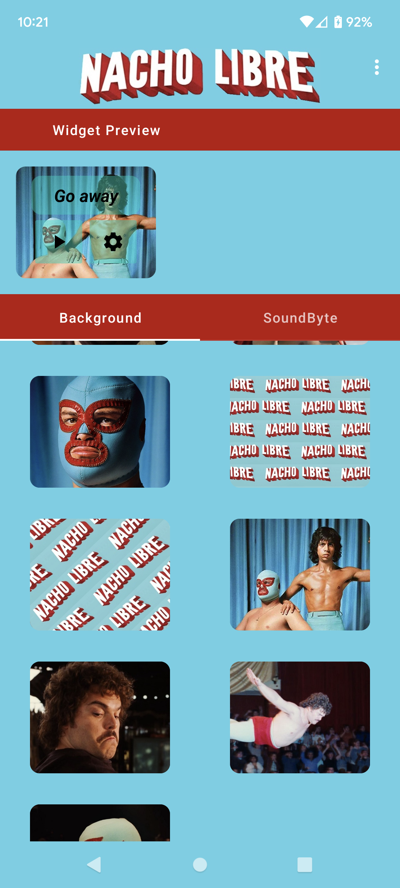
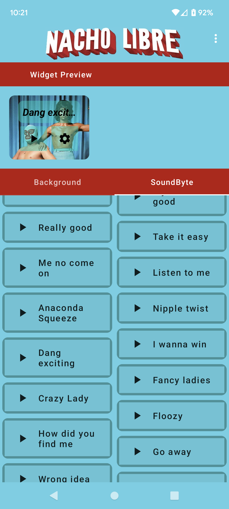
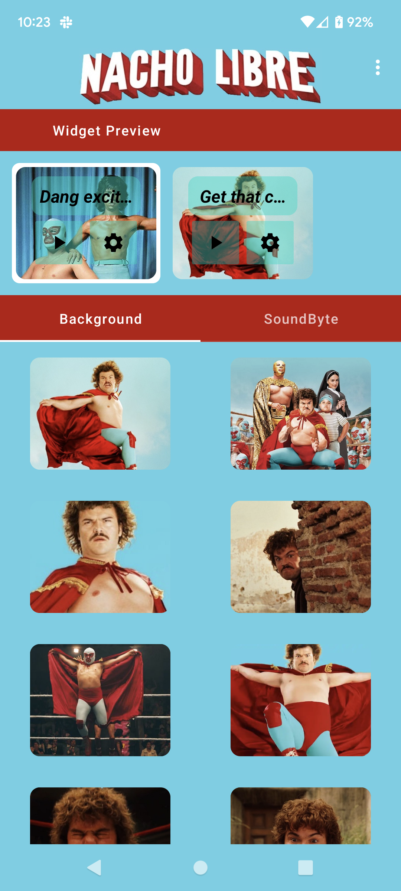
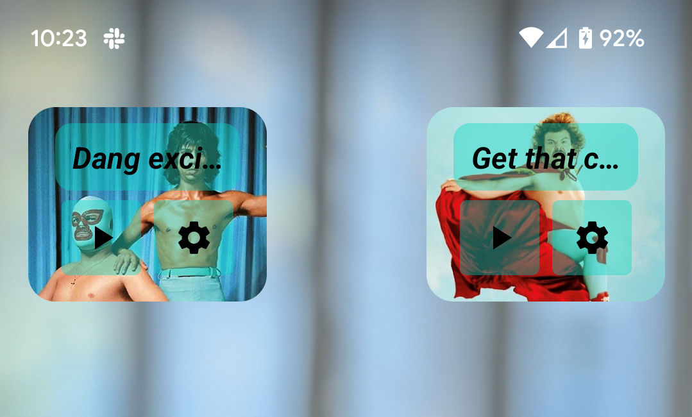

# Nacho (App)

 
 The Nacho app contains a soundboard as well as support for adding widgets customizable with different backgrounds and soundbites.

## About

I wanted to create a soundboard app with widget support using Glance, and a few movies and shows came to mind; Nacho Libre, Lord of the Rings, and Sesame Street. I went with Nacho because the entire movie is lighthearted and quirky.

I based my design off of Josh Stauffer's [Nacho Libre SoundBoard](https://www.joshstauffer.com/projects/nacho/) because I really liked it and was able to reuse a lot of the audio files,  as well as replicate his nacho graphic with modifications to gradient with minor touch-ups. 

The rest of the new graphics/theming including creating title graphic and app theming that gives the Nacho app its look, as well as getting the selectable widget backgrounds by pulling movie advertisements and movie stills.

Being just a fan made app, this will never be published to any appstores.

## Screenshots
### SoundBoard (Main) page
Main Page of the app, used to play Soundbites

   

### Configure Widgets page
Accessible from either the Widgets settings button or from inside the apps vert menu

When no widgets are found

  

Can configure the background of the widget.

  

Can configure the soundbite for each widget.

   

Supports one or multiple widgets

   

### Widgets

Example of two separate widgets

   

## Practice Technologies

The below are the main technologies I was wanting to practice with and do not include all technologies used

- **Jetpack Glance** - not really... I had at first started this wanting to use Compose Widgets using Jetpack Glance, but instantly found out it wasn't quite ready for mainstream use. The main issue was the widget preview required by Android when adding the widget from the launcher still needed to be in XML, meaning tracking multiple implementations which didn't quite look right and caused redundant implementations. In the end it made more sense to ditch Glance and AndroidView wrap the XML so I could preview it in app, and have that preview match the Android OS preview.
- **Android Widgets**

## Future Considerations

If I ever did want to make more changes, they would be generalizing all the files and app names removing all references of "nacho". This would include renaming all classes as well as giving resources generic names such as just ScaffoldTitleGraphic or MainBackground as well as building the resource list programmatically.

For the life of me I could not find a clean way to programmatically read in the Soundbite and Background resources so I could name them NachoSoundbite_<Name> and  NachoWidgetBackground_<Name>, which would make the list of these dynamic and easier when adding or removing. This is something that would make transforming this into a Lord of the Rings or Sesame Street soundboard quicker.
